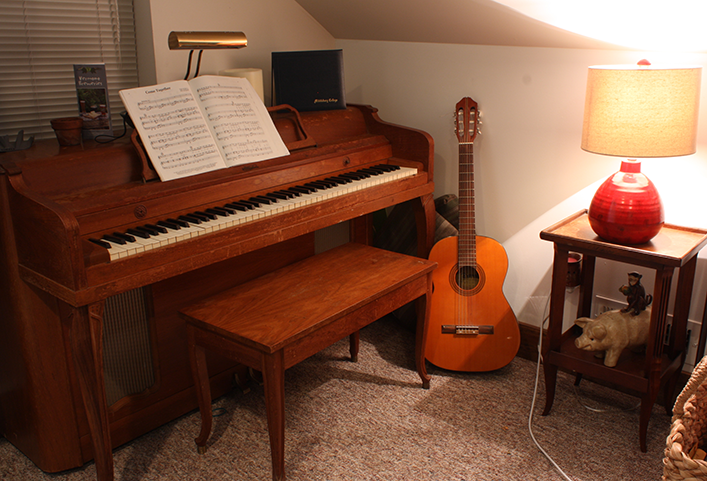
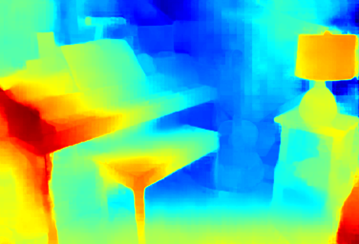

# lightstereo_cpp

## About This Project

该项目是`LightStereo`算法的c++实现，包括`TensorRT`、`RKNN`、`OnnxRuntime`三种硬件平台(推理引擎)

## Features

1. 支持多种推理引擎: `TensorRT`、`RKNN`、`OnnxRuntime`
2. 支持异步、多核推理，算法吞吐量较高，特别是`RK3588`平台

## Demo

|  |  |
|:----------------------------------------:|:----:|
| **left image**  | **disp in color** |

|  nvidia-4060-8G   |   fps   |  cpu   |
|:---------:|:---------:|:----------------:|
|     |      |    |
|     |      |     |

|  jetson-orin-nx-16GB   |   fps   |  cpu   |
|:---------:|:---------:|:----------------:|
|  lightstereo(fp32)   |   40   |  38%   |
|  lightstereo(fp16)   |   70   |  65%   |
|  lightstereo(fp32) - async   |   43   |  45%   |
|  lightstereo(fp16) - async  |   76   |  80%   |